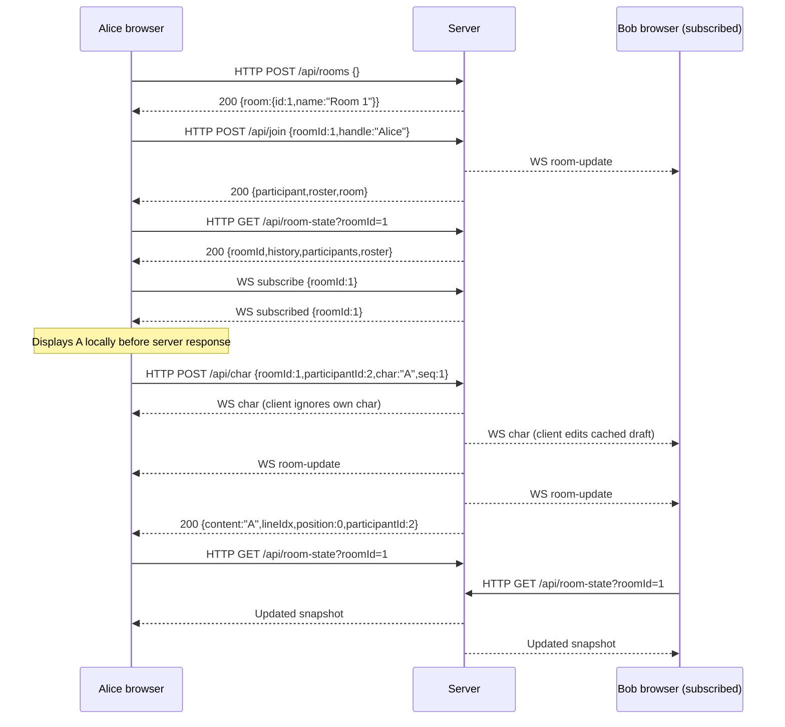

# Current client/server protocol

This describes the implementation inspected on 2026-09-05, not the planned
server-echo/WebSocket rewrite. Chat input currently travels over HTTP. WebSocket
delivers updates, while HTTP snapshots supply authoritative recovery state.
The client displays its own typing optimistically. The planned transport and
20-line join history changes in [TODO.md](../TODO.md) are not implemented.

Sources: [server routes and socket handlers](../server/index.js),
[HTTP client](../client/src/api.ts), [client behavior](../client/src/App.tsx),
and [development proxy](../client/vite.config.ts). Server behavior is the source
of truth for wire fields; some client TypeScript declarations omit fields or
incorrectly exclude `null`.

## Transport and conventions

| Direction | Transport | Purpose |
| --- | --- | --- |
| Browser → server | HTTP GET | Rooms, roster, room snapshots |
| Browser → server | HTTP POST with JSON | Create/select room, join, leave, heartbeat, character, backspace, commit |
| Browser → server | WebSocket JSON | Subscribe to room; optional application ping |
| Server → requesting browser | HTTP JSON response | Requested data, operation result, or error |
| Server → subscribed sockets | WebSocket JSON | Character/backspace events, commit events, room-change notifications |

- Express and WebSocket share one HTTP server, on `PORT` or port 3000.
  The browser uses relative HTTP URLs on its page origin.
- The browser opens `ws://<window.location.host>/`, or `wss://` for an HTTPS
  page. There is no configured WebSocket subprotocol, version, or dedicated path;
  the server's WebSocket upgrade handler is not restricted to `/`.
- Vite serves on port 5173 and proxies `/api` and `/health` to port 3000.
  It does not proxy the application's root WebSocket connection.
- HTTP POST bodies and application WebSocket messages are JSON objects.
  The HTTP wrapper sets `Content-Type: application/json`, including on GETs.
  WebSocket broadcasts are JSON text messages.
- Successful HTTP requests return 200 unless documented as 202. Creation does
  not use 201. Explicit route errors use `{"error":"message"}`. Malformed JSON,
  oversized bodies, and unexpected exceptions use Express's default handling;
  there is no uniform custom JSON error middleware. Unknown API GET routes can
  return an empty 404 when static serving is enabled; other unmatched routes
  fall through to Express's default handling.
- IDs are JSON numbers in responses. Room and participant lookup generally
  applies JavaScript `Number()` to supplied IDs. Prefer numeric IDs in requests;
  this is not a strictly validated schema. Unknown properties are ignored.
- `joinedAt`, `lastSeen`, and `committedAt` are milliseconds since Unix epoch.
  The raw-history endpoint additionally exposes `createdAt` as an ISO date string.
- Joining issues an unpredictable per-participant token (32 lowercase hex
  characters). Every participant mutation — character, backspace, commit,
  heartbeat, and leave — must carry it as the JSON `token` field alongside
  `roomId` and `participantId`. Missing or incorrect tokens are rejected with
  `401 {"error":"invalid token"}` and change nothing. Knowing public
  room/participant IDs alone no longer permits mutations. Socket
  subscriptions do not require joining and carry no token yet. Express uses
  unrestricted `cors()`; the socket handler performs no application origin check.

## Identity and stored state

Rooms and participants are in-memory objects. IDs start at 1 and increment
globally within the process; they can repeat after a restart. A room holds its
participants, committed lines, recent character events, and subscribed sockets.
No database, durable log, or event replay endpoint exists.

Each participant has one draft (`activeContent`) and an optional shared row
(`activeLineIdx`). A first character allocates `greatestLineIdx(room) + 1`.
Committing preserves that index and clears draft ownership; committing without
an allocated row creates a fresh index. Backspacing a draft to empty retains
its index. `lineSlot` is a reusable roster slot from 0 to 9, not transcript order.

Join and leave announcements are ordinary committed records whose content is
`* <handle> joined` or `* <handle> left`. The wire format has no system-line flag.
Stored colors survive the author's departure. Colors are allocated from:

```json
["#00FFFF","#FFFF00","#FF00FF","#00FF00","#FF8000","#80FF00","#FF0080","#00FF80","#8080FF","#FF8080"]
```

The browser stores `{roomId, roomName, participantId, handle, token}` under
`remart-bbs-chat.session` in sessionStorage. Sessions stored before tokens
existed are treated as expired: the client discards them and the user rejoins. Its default handle is stored under
`remart-bbs-chat.handle` in localStorage. `?name=` overrides the default without
overwriting it; `?room=` requests a preferred room through the normal room
selection endpoint. These URL parameters are client conveniences, not server
authentication or socket parameters.

## HTTP endpoint reference

All endpoints below are browser → server requests. Response shapes use
TypeScript-like notation only to describe JSON: `?` means optional, `| null`
means an explicit JSON null is possible, and arrays are JSON arrays.

### GET /health

No body or query parameters. Returns:

```ts
{ ok: true, rooms: number, uptime: number }
```

`rooms` is the number of stored rooms, including empty ones; `uptime` is process
uptime in seconds. The main UI does not call this endpoint.

### GET /api/rooms

No body. Returns rooms sorted by ID:

```ts
{ rooms: Array<{
  id: number, name: string, occupancy: number, max: 10, isLobby: false
}> }
```

Occupancy counts participants whose last activity is at most 40 seconds old.
Listing does not remove stale participants. The lobby polls this every second.

### POST /api/rooms

Request and response:

```ts
// Request; {} is valid
{ preferredId?: number, forceNew?: boolean }
// 200 response
{ room: { id: number, name: string } }
```

With `forceNew` truthy, creates a new empty room. Otherwise chooses the preferred
room if it exists and has fewer than ten non-stale occupants, then the first
available room in insertion order, then creates a room. A preferred ID is a hint,
not a requirement. New names are `Room <id>`. This does not join a participant.
There is no configured room-count limit or explicit route validation error.

### POST /api/join

```json
{"roomId":1,"handle":"Alice"}
```

Example response (timestamps illustrative):

```json
{
  "participant": {
    "id":1,"roomId":1,"handle":"Alice","token":"9f2c…(32 hex chars)",
    "color":"#00FFFF","lineSlot":0,"activeLineIdx":null,"joinedAt":1788600000000
  },
  "roster":[{"handle":"Alice","color":"#00FFFF","lineSlot":0}],
  "room":{"id":1,"name":"Room 1"}
}
```

The server converts a truthy handle to a string, trims it, and limits it to 32
UTF-16 code units. Handles are unique case-insensitively across all rooms.
The target room is cleaned of stale participants before duplicate/capacity
checks. The server assigns a free color, slot, and secret participant token,
initializes sequence 1, creates a join announcement, and sends `room-update`
to existing subscribers. The join response is the only message that carries
the token: it contains neither history nor `nextExpectedSeq` nor draft text.
No snapshot, roster, or broadcast ever exposes the token. Its roster follows
participant insertion order, unlike the sorted roster endpoint.

| Status | Error string |
| --- | --- |
| 400 | `roomId and handle required` (either field falsy) |
| 400 | `handle required` (empty after trimming) |
| 400 | `handle too long` |
| 404 | `room not found` |
| 409 | `Handle already active` |
| 409 | `room full` |

If cleanup deletes the room because its last occupant was stale, the handler
recreates the room under the same id and name, carrying over the committed
lines (preserved stale drafts and leave notices), then completes the join in
that live room. A successful join is therefore always followed by a
discoverable room: the next room-state request returns 200 with the new
participant and their join announcement. Stale handles are reusable once
their occupants are cleaned.

### GET /api/roster?roomId=1

```ts
{ participants: Array<{ handle: string, color: string, lineSlot: number }> }
```

Sorted by `lineSlot`. Does not clean stale participants. Missing room:
404 `{"error":"room not found"}`. Note the response key is `participants`,
whereas join and room-state embed this reduced representation under `roster`.

### GET /api/room-state?roomId=1

The main client's authoritative recovery snapshot:

```ts
{
  roomId: number,
  history: Array<{
    id: string, handle: string, content: string, lineIdx: number,
    committed: boolean, committedAt: number, color: string
  }>,
  participants: Array<{
    id: number, handle: string, color: string, lineSlot: number,
    activeLineIdx: number | null, activeContent: string,
    joinedAt: number, lastSeen: number, nextExpectedSeq: number
  }>,
  roster: Array<{ handle: string, color: string, lineSlot: number }>
}
```

The server takes the **last 100 appended committed records**, then sorts that
subset by `lineIdx`. This is not necessarily the highest 100 line indices:
participants can commit earlier allocated rows later. Participants and roster
are sorted by slot. No stale cleanup or presence refresh occurs on this GET.
Missing room: 404 `{"error":"room not found"}`.

The snapshot does not filter by viewer identity or join time. The client does
that locally, excluding records with `committedAt < ownParticipant.joinedAt`,
and accumulates seen records by ID beyond the snapshot limit. Newcomers do not
currently see the proposed last 20 lines. Snapshot truncation does not truncate
server storage: `room.lines` grows for the lifetime of the room.

### GET /api/room/:id

An additional endpoint not used by `client/src/api.ts`. Returns:

```ts
{
  participants: Array<{
    id: number, handle: string, color: string, lineSlot: number,
    activeLineIdx: number | null, activeContent: string, joinedAt: number
  }>,
  history: Array<{
    id: string, handle: string, content: string, committed: true,
    lineIdx: number, createdAt: string, committedAt: number,
    colorSnapshot: string
  }>
}
```

Unlike room-state, it exposes **all** stored history in append order, raw
`colorSnapshot` and `createdAt` fields, and participants in insertion order.
It omits `roomId`, `roster`, `lastSeen`, and `nextExpectedSeq`. Missing room:
404 `{"error":"not found"}`. Treat line IDs as opaque strings.

### POST /api/heartbeat

```ts
// Request
{ roomId: number, participantId: number, token: string }
// 200 response
{ alive: boolean, removed: number }
```

The token is required: a missing or incorrect token returns
`401 {"error":"invalid token"}` without refreshing presence.

Missing room or participant returns `{alive:false, removed:0}` rather than 404.
Otherwise refreshes that participant's `lastSeen` before cleaning other stale
participants. `removed` counts participants removed by this cleanup. May emit
`room-update` when others are removed. No sequence number is involved.

### POST /api/leave

```ts
// Request
{ roomId: number, participantId: number, token: string }
// 200 response
{ freed: boolean }
```

The token is required: a missing or incorrect token returns
`401 {"error":"invalid token"}` and the participant stays in the room.

Missing room or participant returns `{freed:false}`. A successful leave preserves
nonempty draft text as a committed line, adds a leave announcement, removes the
participant and their character-event records, and returns `{freed:true}`.
If participants remain, emits `room-update`. Otherwise deletes the room without
that broadcast. No dedicated leave event or socket close is sent. Buffered input
for the participant is not drained as part of leave. Leave is outside sequence
ordering and can race with in-flight typing.

On `pagehide`, the browser sends this same JSON as an `application/json` Blob via
`navigator.sendBeacon`. If unavailable or throwing, it falls back to a POST fetch
with `keepalive:true`. A false return from `sendBeacon` does not trigger the
fallback. The client does not inspect the leave response on this exit path.

### POST /api/char, /api/backspace, /api/commit

These three endpoints carry the actual chat input. Request shapes:

```ts
// /api/char
{ roomId: number, participantId: number, token: string, char: string, seq?: number }
// /api/backspace and /api/commit
{ roomId: number, participantId: number, token: string, seq?: number }
```

Neither backspace nor commit sends draft content or a line index. The server
operates on its stored draft. All three first validate room, participant,
and token:

| Status | Error string |
| --- | --- |
| 404 | `room not found` |
| 404 | `user not in room` |
| 401 | `invalid token` (missing or incorrect token; nothing is applied) |
| 400 | `invalid char` (character endpoint only) |

Character validation requires a string with `Array.from(char).length === 1`,
rejects CR, LF, DEL, and C0 controls other than tab. Spaces and supplementary
Unicode characters are allowed. This counts code points, not grapheme clusters;
it is not comprehensive validation of printable Unicode. There is no line-length
cap or application typing throttle. The server does not enforce the client's
100-character paste limit; each accepted pasted character is a separate POST.

Applied (or legacy) 200 responses:

```ts
// /api/char
{ content: string, lineIdx: number, position: number, participantId: number }
// /api/backspace; lineIdx may be null for an unallocated empty draft
{ content: string, lineIdx: number | null, participantId: number }
// /api/commit; no next row is reserved
{ newLineIdx: null, committedContent: string, committedAt: number }
```

Character `position` is resulting JavaScript string length minus one, in UTF-16
code units. Backspace removes one UTF-16 code unit with `slice(0,-1)`, which can
corrupt emoji. A backspace on empty content refreshes presence but broadcasts
nothing for that operation. A commit on empty content still creates a line.
Successful applied operations refresh presence.

These normal responses omit `seq`, `expected`, and status flags. A request that
unblocks buffered operations returns its own immediate result, not the state
after the subsequent drain. For example, character seq 1 can return `content:"A"`
even though draining buffered commit seq 2 has already cleared the draft.

## Sequence numbers and delivery guarantees

All three chat endpoints share one sequence counter per participant, starting
at 1. The browser assigns it in input order and sends normal typing operations
concurrently. This counter is unrelated to the room-wide `lineIdx`.

| Incoming seq | Server action | HTTP result |
| --- | --- | --- |
| Missing or null | Apply immediately; do not advance the sequence counter or drain buffered operations | 200 normal result |
| Less than expected | Do not apply again | 200 duplicate result |
| Equal to expected | Apply, advance counter, drain consecutive buffered operations | 200 normal result |
| Greater than expected | Store operation in the participant's Map and refresh presence | 202 buffered result |

Normal buffered response for any of the three routes:

```json
{"buffered":true,"expected":1,"received":2,"participantId":1}
```

This means accepted for later processing, not applied. It contains no content or
line index. There is no later HTTP completion response; eventual application
produces socket notifications and becomes visible in snapshots.

Duplicate character/backspace response:

```ts
{
  content: string, lineIdx: number | null, participantId: number,
  duplicate: true, expected: number
}
```

This reports the **current** draft, not the original operation's result.
Duplicate character responses omit `position`. Duplicate commit response:

```ts
{ newLineIdx: null, committedContent: "", committedAt: number,
  duplicate: true, expected: number }
```

Its timestamp is the retry-handling time, not the original commit timestamp.
Duplicates do not refresh `lastSeen` or broadcast. The empty-backspace branch
also contains response variants without `participantId`/`expected`, but those
buffered/duplicate branches are not reached with normal numeric sequences:
that branch only admits an expected sequence or legacy input.

There is no integer/range/type validation for `seq`, buffer bound, gap timeout,
or automatic retry. Reusing a future buffered sequence overwrites its Map entry.
A missing operation can stall all later operations indefinitely. The client
increments before sending and does not retransmit failures. It raises its next
sequence to the server's `nextExpectedSeq` when a snapshot reports a higher value;
that does not repair an earlier missing sequence. HTTP error responses are
converted to plain `Error` messages by the client, losing structured status data.

## WebSocket message reference

### Browser → server

On socket open, the browser sends:

```json
{"type":"subscribe","roomId":1}
```

If the room exists, the server adds the socket to its subscriber Set and replies:

```json
{"type":"subscribed","roomId":1}
```

This acknowledgment contains no snapshot, participant identity, revision, or
replay position. Joining by HTTP and subscribing are independent operations.
Subscribing to a missing room is silently ignored. There is no unsubscribe
message. Subscribing again to a different room does not remove the socket from
the old room's Set; close cleanup tracks only the last room. The normal client
instead closes and replaces its socket when the session changes.

The server also accepts an application-level ping and responds on that socket:

```json
{"type":"ping"}
```

```json
{"type":"pong"}
```

The current browser does not send this ping. It does not refresh participant
presence and is separate from WebSocket control frames and HTTP heartbeat.
Malformed JSON, unknown message types, and client-sent chat operations over the
socket are silently ignored; there is no socket error-response envelope.

### Server → all room subscribers

Every open socket in the room Set receives these, including the author's socket
if subscribed. The server does not associate a socket with a participant.

| Type | Fields beyond `type` | Meaning |
| --- | --- | --- |
| `room-update` | `roomId` | Invalidate/refetch room state; contains no state itself |
| `char` | `roomId`, `participantId`, `char`, `lineIdx`, `position`, `handle`, `seq` | One character appended |
| `backspace` | `roomId`, `participantId`, `lineIdx`, `position`, `handle`, `seq` | One UTF-16 code unit removed; position is resulting content length |
| `commit` | `roomId`, `participantId`, `lineIdx`, `committedContent`, `seq` | Draft committed at this line index |

Examples of individual messages (each is a separate JSON frame):

```json
{"type":"char","roomId":1,"participantId":1,"char":"A","lineIdx":2,"position":0,"handle":"Alice","seq":1}
```

```json
{"type":"backspace","roomId":1,"participantId":1,"lineIdx":2,"position":0,"handle":"Alice","seq":2}
```

```json
{"type":"room-update","roomId":1}
```

```json
{"type":"commit","roomId":1,"participantId":1,"lineIdx":2,"committedContent":"","seq":3}
```

Character/backspace `seq` is null for legacy requests without a sequence.
A legacy commit sends only `room-update`, not a `commit` event. Commit events
omit the committed record's ID, timestamp, color, and handle, so they are not
equivalent to a history record. There is no event ID or room revision.

Per applied operation, server emission order is:

| Trigger | Socket messages, in order |
| --- | --- |
| Character | `char`, then `room-update` |
| Nonempty backspace | `backspace`, then `room-update` |
| Empty backspace | None for this operation |
| Sequenced commit | `room-update`, then `commit` |
| Legacy commit | `room-update` only |
| Join | `room-update` (cleanup can cause an earlier notification too) |
| Leave/stale removal with survivors | `room-update` |
| Last participant removed | No final room notification; room is deleted |

Drained operations emit their own messages in sequence order. These sends occur
before the triggering HTTP route calls `res.json`, but there is no guaranteed
arrival order between separate HTTP responses and socket messages. A socket
preserves its own message order; snapshots have no revision tying them to it.

## Client interpretation and timing

| Activity | Current client behavior |
| --- | --- |
| Lobby | Fetch rooms, nominally every 1 second |
| Joined session | Fetch room-state, nominally every 2 seconds, even with a healthy socket |
| Presence | HTTP heartbeat immediately on session effect, then every 12 seconds |
| Unexpected socket close | Attempt a new connection after 1.2 seconds and resubscribe |
| Socket error | Close socket; close handler schedules reconnect |
| Session change/unmount | Close socket and cancel reconnect timer |
| Page hide | Best-effort HTTP leave via beacon/keepalive |

These are configured intervals, not network timing guarantees; browsers may
throttle background timers and query invalidation can cause additional fetches.

The client ignores socket events with a truthy different `roomId`, and ignores
its own `char`/`backspace` events to avoid duplicating optimistic input. For other
participants it appends chars to cached draft content, with a position/character
check attempting deduplication. Backspace simply slices cached content, ignoring
the supplied position and sequence. Events for unknown participants or before
the first cached snapshot do not create participants. `room-update` and `commit`
both invalidate room-state instead of directly updating history. The client
does not process `subscribed` or `pong` beyond ignoring them.

Normal successful HTTP operations also invalidate room-state. A buffered
character/backspace/commit response skips that invalidation in the normal input
handlers; the paste handler invalidates even for buffered responses. There is
no strict synchronization between in-flight snapshots and socket cache edits.

Local typing and Enter render before confirmation. Pending commits are matched
to history by handle, content, and `committedAt >= localCommitTime - 1000`, not
by a shared commit identifier. Finished-draft indices suppress stale live rows.
This is client reconciliation, not a wire acknowledgment mechanism.

Any room-state query error currently clears the session, including transient
network errors; so does a snapshot without the current participant. Heartbeat
errors are ignored, whereas `{alive:false}` clears the session. Socket loss alone
does not clear it. A healthy socket cannot by itself maintain presence.

### Commands and paste

Commands are interpreted **only by the client** on Enter. It compares
`activeContent.trim()` to lowercase `l`, `?`, or `q`; thus surrounding whitespace
currently still permits a command, despite the UX document's exact-character
description. The characters have already been sent as ordinary chat input.

| Client command | Requests/actions instead of `/api/commit` |
| --- | --- |
| `l` | Send sequenced backspaces to clear command text, then GET roster and invalidate room-state |
| `?` | Show local help and send sequenced backspaces to clear command text |
| `q` | Send sequenced backspaces to clear command text, then POST leave |

Command clearing sends one backspace for each UTF-16 code unit of the draft,
awaiting each response. These command actions use a client promise queue;
ordinary typing sends do not. Toolbar actions can invoke roster/help/leave
without typing a command. The server has no command opcode and would commit
literal `q` if a different client sent `/api/commit` for that draft.

Paste takes the first 100 code points, then removes invalid characters (including
newlines), then sends each remaining character as an individual sequenced POST.
It warns if the original paste exceeded 100. There is no batch/paste endpoint,
and pasted newlines do not commit lines.

## Example session exchange



The diagram chooses one illustrative interleaving: snapshot fetch, subscription,
and heartbeat start independently after joining. A notification can precede
subscription, and an HTTP response can arrive before or after related socket
frames. There is no atomic subscribe-plus-snapshot handshake.

For reordered input `A` then Enter, if commit seq 2 arrives first it returns
202 with `expected:1`. When character seq 1 arrives, the server applies `A`,
drains the commit, emits the corresponding four notifications, and returns the
character result. A later snapshot shows committed `A` and an empty draft.

## Lifetime and current limitations

- Stale means `lastSeen < now - 40000`. Cleanup runs every 15 seconds, on join,
  and during valid heartbeats. Timeout and physical removal are separate;
  lists can exclude stale occupants before they have been deleted.
- Applied input and buffered future input refresh presence; duplicates, reads,
  socket subscriptions, and application pings do not. Stale cleanup commits
  nonempty drafts with `committedAt` equal to the participant's last activity,
  then adds a leave announcement at cleanup time. Explicit leave timestamps
  preserved draft text at leave time instead.
- Rooms are deleted when leave/stale cleanup removes their last participant.
  Newly created rooms that never had a participant are not removed by the stale
  sweep, because cleanup returns early when there are no stale participants.
- Socket close removes a subscription, not a participant. Participant leave
  does not explicitly unsubscribe sockets. There is no shutdown, room-deleted,
  or participant-expired push message.
- Internal `charEvents` is trimmed from over 1000 entries to the last 800, but
  is not exposed for replay. Committed history and sequence-gap buffers have
  no configured size bound. The room's `nextLineIdx` field exists but allocation
  currently scans committed and active rows for the greatest index.
- There is no global ordering/revision marker for merging HTTP snapshots with
  socket events, no missed-event replay, and no durable exactly-once guarantee.
  Participant authorization (TODO tasks 1 and 4) is implemented; the remaining
  Unicode, gap recovery, and lifecycle defects are tracked in
  [TODO.md](../TODO.md). This document records their observable behavior rather
  than promising the planned fixes.

Existing protocol coverage is in [HTTP tests](../test-server-api.js),
[sequence tests](../test-server-seq.js),
[WebSocket tests](../test-server-websocket.js), and
[Enter-latency tests](../test-server-regression-enter-latency.js).
Update this reference alongside future wire-protocol changes.
